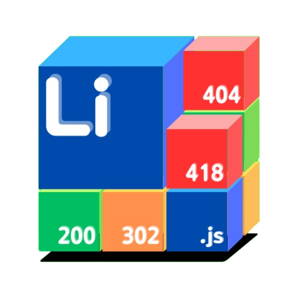

# 停止支援
本專案將永久轉移至 [Liminal-NSP](https://github.com/caloutw/Liminal-NSP) 上<br>
此項目將永遠不再更新。

<div align="center">

<h1>Liminal-WM</h1>
<p>Liminal Web Manager</p>
<sub>基於Nodejs的網頁管理員</sub>
<p></p>
</div>

  

<div align="center">

[English](readme_en.md) | 繁體中文


</div>


# 尚未公開
這是一個尚未完成的項目，請等等...


# Liminal-WM Beta v9

基於Nodejs框架打造的網頁管理器

浪費了我人生的24小時，就為了方便以後架js的網頁

原本想說用Expressjs寫，後面發現用原生的http也可以

為了避免一堆問題我就跑回去開原生了

~~(我寫到一半才知道原生可以用，快爆炸了)~~

總之，這東西方便易用

然後為了搞定伺服器端運行，我還讓他可以運行nodejs (伺服器端)

總算是補足了不能使用php的痛點。

~~(鬼才知道我浪費多少時間在處理這個)~~


# 運行需求
- [Nodejs v20](https://nodejs.org/en)


# 測試環境
- Linux ( ubuntu LTS22.04 )


# 伺服器框架
跟以往伺服器請求使用的php不一樣

使用的是nodejs，且限定 CommonJS (第一版饒了我拜託)

~~(還可以使用伺服器端跑Discord Bot WTF)~~


# Javascript檔案
每個要讓伺服器運行的 ``.js`` 規格應當如下

一個 ``Liminal_main`` 函數，接收 ``req`` 和 ``param`` 兩個參數

``req``是網頁請求類別，跟普通的req一樣

``param``是參數，如果不用POST，那參數就會以物件傳遞


``./T/Test.js``
```js
async function Liminal_main(req, param){
	return "Hello World";
}

module.exports = {
	Liminal_main : Liminal_main
}
```
接下來進入``localhost:51000/Test/Test.js``
應該就會看到它輸出的 Hello World 了

( 請見資料夾中的 T/Test.js )

Next~


# 基礎運行

網頁運行請在``/``創建資料夾，在資料夾中創建檔案即可

修改網頁Port於 ``./_Service/Data/config.json`` 中的 ``running_port``

> 記住 : 如果你允許了根目錄導向根目錄，在那之後的所有資料夾導向邏輯將被覆蓋。


# 如何運行
``node ./main.mjs``

然後你將會於 ``localhost:51000/_Service/`` 看到管理端網頁

加油吧，孩子

我以後還會回來更新的

歡迎提issue


# 感謝
非常感謝 nodejs 的開發者

還有我的大腦。
